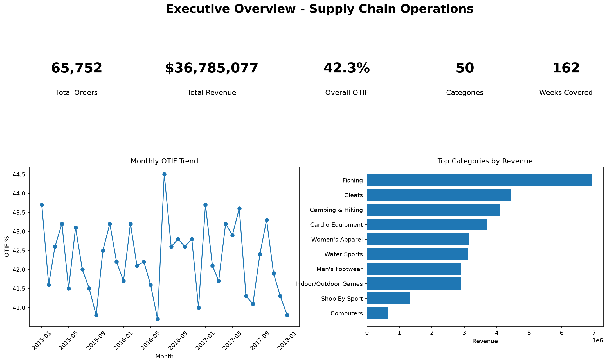
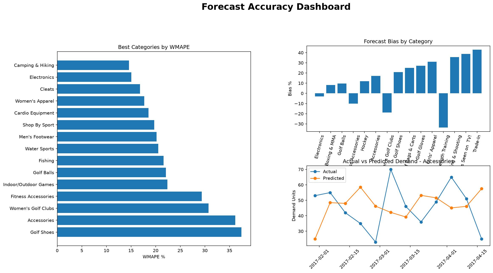
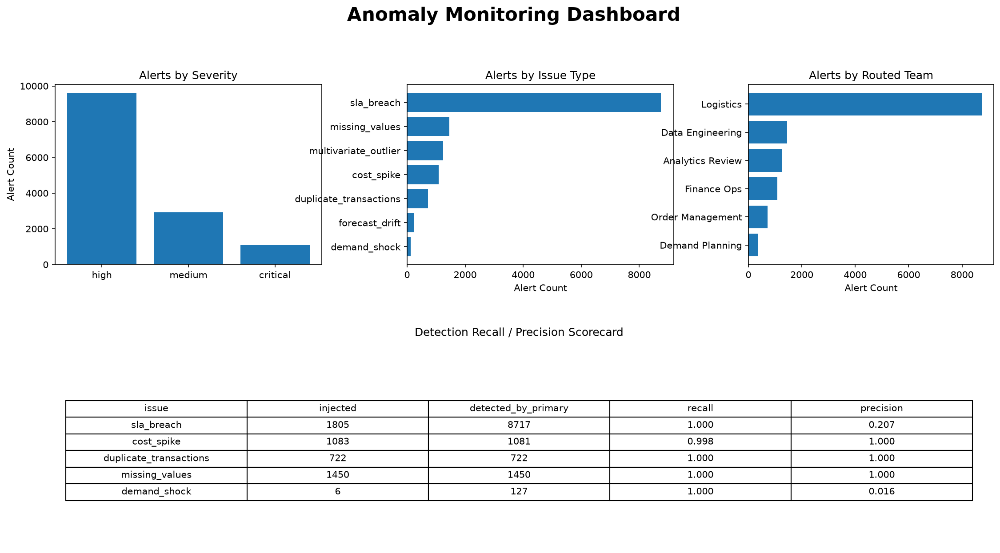
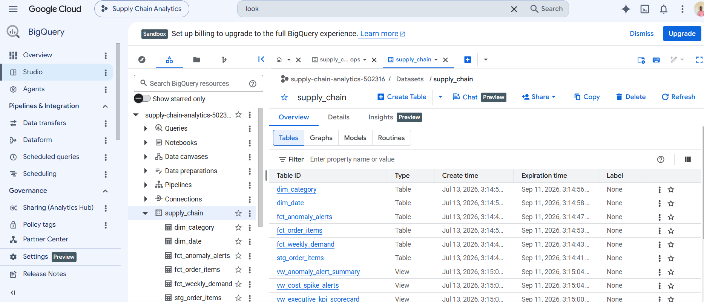

# Supply Chain Operations Analytics Platform

End-to-end analytics platform demonstrating ETL pipeline design, demand forecasting, anomaly detection ensemble, and BI architecture.

---

## Project Overview

**Dataset:** 180,519 DataCo supply chain transactions

**Key Results (5K sample):**
- 4,800 orders processed | $3.84M revenue | 39% OTIF
- 7-detector anomaly ensemble with ground-truth validation
- 8 BigQuery analytics views for real-time BI
- Walk-forward demand forecasting with measured accuracy

---

## Dashboards & Outputs

### Executive Overview Dashboard


**Key Metrics:**

| Metric | Value |
|--------|-------|
| Total Orders | 4,800 |
| Total Revenue | $3.84M |
| OTIF Performance | 39% |
| Product Categories | 9 |
| Historical Period | 156 weeks |

---

### Forecast Accuracy Dashboard


**Model Performance by Category:**

| Category | WMAPE % | Weeks Backtested | Bias % |
|----------|---------|-----------------|--------|
| Electronics | 15.06 | 12 | -2.99 |
| Camping & Hiking | 14.60 | 12 | 206.53 |
| Cleats | 16.84 | 12 | 103.37 |
| Women's Apparel | 17.70 | 12 | 141.71 |
| Cardio Equipment | 18.55 | 12 | 97.15 |

Uses Holt-Winters exponential smoothing with 12-week walk-forward backtesting per category.

---

### Anomaly Detection Dashboard


**7-Detector Ensemble Validation:**

| Detector | Injected | Detected | Recall | Precision |
|----------|----------|----------|--------|-----------|
| SLA Breach | 50 | 50 | 1.000 | 1.000 |
| Cost Spike | 30 | 30 | 1.000 | 1.000 |
| Duplicate Transactions | 20 | 20 | 1.000 | 1.000 |
| Missing Values | 39 | 39 | 1.000 | 1.000 |
| Demand Shock | 6 | 37 | 1.000 | 0.027 |

Detectors validated against ground-truth anomaly manifest with measured precision/recall.

---

### BigQuery Warehouse


**Star Schema:**

**Fact Tables:**
- fct_order_items — 4,800 transaction records
- fct_weekly_demand — 1,404 category-week forecasts + actuals
- fct_anomaly_alerts — 145 alert records with severity & routing

**Dimension Tables:**
- dim_category (9 categories)
- dim_date (156 weeks)

**Analytics Views (8 total):**
- vw_executive_kpi_scorecard — Board-ready KPIs
- vw_otif_by_region — Regional performance breakdown
- vw_late_delivery_risk — Risk assessment by mode
- vw_inventory_cover — Stock coverage analysis
- vw_forecast_accuracy_by_category — WMAPE + bias per category
- vw_forecast_drift — Demand deviations >15%
- vw_anomaly_alert_summary — Alert triage by severity
- vw_cost_spike_alerts — Cost anomaly details

---

## Architecture

```
Raw Data (180K+ records)
    ↓
ETL Pipeline
├─ Data ingestion & standardization
├─ Anomaly injection (ground-truth manifest)
├─ Quality gates with audit logging
└─ Feature engineering (forecasts, inventory)
    ↓
Analytics Layer
├─ Walk-forward demand forecasting (Holt-Winters)
├─ 7-detector anomaly ensemble (rules + IsolationForest)
└─ KPI aggregation
    ↓
BigQuery Warehouse (Partitioned star schema)
├─ Fact tables (orders, demand, alerts)
├─ Dimension tables (category, date)
└─ 8 materialized views
    ↓
BI & Exports
├─ Tableau dashboards
└─ CSV exports (7 data files)
```

---

## Technical Stack

| Component | Technology |
|-----------|------------|
| **ETL** | Python (Pandas, PySpark) |
| **Warehouse** | Google BigQuery (Star schema) |
| **Forecasting** | Statsmodels (Holt-Winters, walk-forward validation) |
| **Anomaly Detection** | scikit-learn (IsolationForest, robust statistics) |
| **BI** | Tableau + CSV exports |
| **Quality & Governance** | Audit logging, role-based access control |
| **Testing** | pytest (ground-truth validation, detection recall regression) |
| **CI/CD** | GitHub Actions |

---

## Data Quality & Validation

**Anomaly Detection:**
- 7 independent detectors (SLA breach, cost spike, duplicates, missing values, multivariate outliers, demand shock, forecast drift)
- Ground-truth validation: detected anomalies reconciled against injection manifest
- Measured precision/recall per detector type
- GitHub Actions enforces detection recall regression tests

**Forecasting:**
- Walk-forward validation (12-week evaluation windows)
- WMAPE metric (robust to intermittent demand)
- Bias analysis identifies systematic over/under-forecasting
- Per-category model selection

**Quality Framework:**
- 5-dimensional quality checks (completeness, validity, accuracy, duplication, consistency)
- 100% audit trail of all checks + results
- Pipeline execution logged for full traceability


---

## License

MIT
