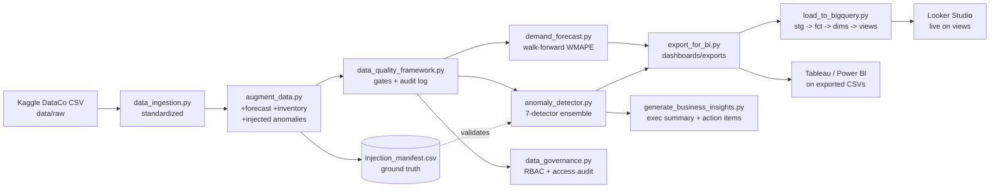

# Architecture & Design Decisions

## Flow
raw Kaggle CSV -> ingestion (standardize, latin-1) -> augmentation
(+forecast/inventory, +injected anomalies w/ manifest) -> quality gates
(audit-logged) -> forecasting (walk-forward) -> ensemble anomaly detection
(validated vs manifest) -> BI exports (Power BI / Tableau) — all orchestrated
by `pipeline_orchestration.py` with per-stage timing + run logging.

## Decisions decisions
**Raw data is git-ignored.** 90MB CSVs don't belong in git and Kaggle
licenses typically forbid redistribution. The compliant pattern: download
instructions + ingestion script + committed dev sample. This is itself a
governance talking point.

**Tiered forecasting.** Prophet -> Holt-Winters -> seasonal-naive fallback
behind one interface and one evaluation harness. The repo runs anywhere;
reported metrics come from the Prophet tier. Trade-off: fallback quality is
visibly worse — which is fine, because the harness makes that measurable.

**Rules where rules are right, ML where it isn't.** SLA breach is a
contractual rule; cost spikes are per-line reconciliation vs catalog price;
IsolationForest only covers the multivariate residual space. Using ML for
everything would be worse AND harder to explain to stakeholders.

**Python-simulated RBAC.** Production would use Snowflake roles + grants +
ACCESS_HISTORY; the repo expresses the identical policy in
`data_governance.py` (role grants, confidentiality labels, 100% audit trail
incl. denials) so the control is demonstrable without a paid account.

**Run-keyed logs everywhere.** Quality audits, pipeline runs, access audits
all append-only with timestamps — the compliance trail reviewers ask about.

## Production next steps
Airflow/Dagster DAG for the stage graph; dbt for the SQL layer; Snowflake
Snowpipe for ingestion; alert webhooks (Slack) keyed on severity; CI job
that runs the pipeline on the dev sample and fails if detection recall on
the manifest drops below threshold (a literal regression test for the
detectors).

## Data lineage

